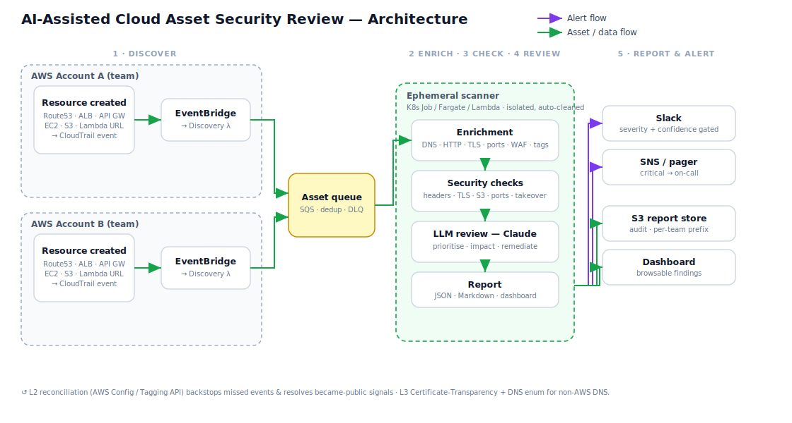

# AI-Assisted Cloud Asset Security Review

Automatically discovers newly created internet-facing AWS assets and runs an AI-assisted security review:

```
New asset → Discovery → Enrichment → Security checks → LLM review → Report
```

Runs locally with **no AWS account and no API key**. Sample CloudTrail events drive discovery; the LLM falls back to a heuristic when no API key is set.

**More detail:** [Production setup](docs/PRODUCTION_SETUP.md) · [Architecture](ARCHITECTURE.md) · [Design](DESIGN.md) · [Threat model](THREAT_MODEL.md) · [Sample report (PDF)](docs/sample-report.pdf)

## Architecture



---

## Design decisions & tradeoffs

Full write-up: [DESIGN.md](DESIGN.md). Summary of the main calls:

| Decision | Why | Tradeoff |
|---|---|---|
| **Checks are source of truth; LLM is the analyst** | Deterministic findings with evidence stay auditable; the LLM prioritises and writes remediation — it never invents vulnerabilities | The LLM can't find issues the checks never collected signal for — extend checks, don't trust free-form scanning |
| **Event-driven discovery (CloudTrail → EventBridge)** | Near-real-time, scales with *change rate* not fleet size; events carry account/region/actor for ownership | CloudTrail can drop/delay events; non-AWS DNS pointing at AWS is invisible — mitigated by Config reconciliation (L2) and CT logs (L3, not yet built) |
| **SQS between discovery and scanning** | Absorbs bursts, horizontal scaling, retries + DLQ for poison messages | At-least-once delivery — scans may run twice (acceptable: read-only, idempotent) |
| **Curated rule registry, not nuclei/ZAP** | Transparent, dependency-free, easy to extend and feed into the LLM | Less coverage than a full scanner suite — heavier tools can plug in behind the same queue later |
| **Confidence scoring + content validation** | Path probes (e.g. `/.env`) use soft-404 detection and content signatures so SPAs don't false-positive as CRITICAL | Per-path heuristics need maintenance; confidence is a coarse 3-level scale, not a calibrated score |
| **Asset-type-scoped checks** | Web header/method rules don't run against S3 (S3 legitimately uses PUT/DELETE) | More check logic to maintain per asset type |
| **Ephemeral, isolated workers** | Each scan touches untrusted targets — disposable Fargate tasks, egress-only networking, no shared state | Per-scan scheduling overhead vs. a warm pool; production uses always-on Fargate for simplicity over per-asset Jobs |
| **Stdlib-first core** | Zero deps locally, tiny container, fast cold start, smaller attack surface | Less capable than `requests`/full DNS libraries — optional `[dns]`/`[aws]` extras close gaps |
| **Private S3 dashboard** | Reports are sensitive — bucket is encrypted and not public by default | No browser URL out of the box; download with `aws s3 cp` or add CloudFront + auth |

**Known gaps (by design for this prototype):** tier-2 correlation (SG opens → resolve public IP), finding dedup/lifecycle, multi-account assume-role for S3 API checks, public dashboard URL. See [DESIGN.md § What I'd do next](DESIGN.md#what-id-do-next-prototype--production).

---

## Setup

### Local development (no AWS account)

**Requires:** Python 3.10+

```bash
git clone https://github.com/snorlax-collab/cloud-asset-security-review.git
cd cloud-asset-security-review
make setup
make test && make demo
```

**Plug and play:** `./setup.sh` → demo + dashboard at http://localhost:8000

| Step | Command | What it does |
|---|---|---|
| Install | `make setup` | venv, package, copies `.env.example` → `.env` |
| Verify | `make test` | 85 tests (no network required) |
| Try it | `make demo` | Replays sample CloudTrail events → `reports/` |
| Dashboard | `make serve` | Serves `reports/index.html` at http://localhost:8000 |
| Live scan | `make scan HOST=example.com` | Probes a real host (optional) |

### Optional local config (`.env`)

Copy `.env.example` to `.env` and fill in what you need:

| Variable | Required for | Notes |
|---|---|---|
| `ANTHROPIC_API_KEY` | Real Claude review | Without it, a deterministic heuristic is used |
| `SLACK_WEBHOOK_URL` | Slack alerts | Test with `make notify-test` |
| `SLACK_ALERT_THRESHOLD` | Alert filtering | Default `LOW` — alerts on LOW and above |
| `SLACK_NOTIFY_NEW_ASSETS` | New-endpoint cards | Default `true` |

These apply to local `make scan` / `make poc` and to production workers (via Secrets Manager in AWS).

### Production AWS (continuous monitoring)

> **Full step-by-step guide:** [`docs/PRODUCTION_SETUP.md`](docs/PRODUCTION_SETUP.md)

For **always-on discovery and scanning** when new internet-facing assets are created, deploy the Terraform stack.

**Quick summary — what you need before deploy:**

| Requirement | Why |
|---|---|
| **AWS account** with admin or scoped IAM | Creates Lambda, ECS, SQS, S3, EventBridge, Secrets Manager, ECR |
| **CloudTrail** with management events enabled | Discovery listens on the default EventBridge bus fed by CloudTrail |
| **Terraform ≥ 1.5** + **Docker** + **AWS CLI** | Deploy infrastructure and push the scanner image |
| **`ANTHROPIC_API_KEY`** | Real LLM review — set in `.env`, then `make set-scanner-secret` |
| **`SLACK_WEBHOOK_URL`** (recommended) | Real-time alerts — same flow as Anthropic key |
| **Default VPC with internet egress** | Fargate workers need outbound access to probe targets |

**Deploy (4 commands):**

```bash
cp infra/terraform/terraform.tfvars.example infra/terraform/terraform.tfvars
# Edit: aws_region, worker_desired_count  (secrets go in .env → make set-scanner-secret)

make deploy-init
make deploy-apply-base AWS_REGION=ap-south-1
make set-scanner-secret AWS_REGION=ap-south-1   # reads ANTHROPIC_API_KEY / SLACK from .env
make deploy-push-image AWS_REGION=ap-south-1
# Add scanner_image=... (printed by push step) to terraform.tfvars, then:
make deploy-apply AWS_REGION=ap-south-1
```

**Verify, view dashboard, troubleshoot:** see [`docs/PRODUCTION_SETUP.md`](docs/PRODUCTION_SETUP.md).

**POC without full deploy:** `make poc HOST=your-api.execute-api.region.amazonaws.com` — single manual scan with Slack; not continuous monitoring.

---

## Run it

```bash
make demo                     # replay sample events → reports/
make dashboard                # demo + serve at :8000
make scan HOST=example.com    # scan a live host
make stack                    # full Docker stack (SQS + workers) → :8000
make stack-down               # stop Docker stack
```

**Sample output:** [`docs/sample-report.pdf`](docs/sample-report.pdf) is a dashboard-style PDF (overview metrics, findings chart, per-asset detail). Source JSON lives in [`docs/sample-reports/`](docs/sample-reports/). A live-scan example for `example.com` is in [`docs/sample-report-example.com.pdf`](docs/sample-report-example.com.pdf). Regenerate with `make sample-pdf` (requires Chrome).

---

## CLI

| Command | Purpose |
|---|---|
| `scan --host H` | Live scan + review |
| `discover --event FILE` | Review one CloudTrail event |
| `demo [--out DIR]` | Replay bundled sample events |
| `publish` / `worker` | SQS queue path (see `make stack`) |
| `dashboard-sync` | Rebuild `index.html` from S3 report JSON |
| `serve` | HTML dashboard |
| `info` | List events and checks |

Flags: `--json`, `--no-ports`, `--fail-on SEVERITY`

---

## AWS deployment

Terraform modules: [`infra/terraform/`](infra/terraform/). **Setup guide:** [`docs/PRODUCTION_SETUP.md`](docs/PRODUCTION_SETUP.md).

---

## Project layout

```
src/asset_review/   discovery, enrichment, checks, llm, orchestrator, report, storage
infra/              Terraform (production) + EventBridge/K8s stubs
docs/               diagrams + sample reports
tests/              85 tests (no network required)
```
