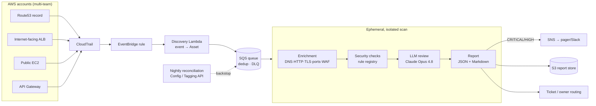

# Architecture


## Pipeline

```
                  ┌──────────────────────────────────────────────────────────────┐
 AWS accounts     │                    CONTROL PLANE (cheap, fast)               │
 (multi-team)     │                                                              │
   resource  ──▶ EventBridge rule ──▶ Discovery Lambda ──▶ SQS queue ──┐         │
   creation       (match create        (event → Asset,     (buffer,    │         │
                   events)              owner tags)         dedup, DLQ) │         │
                  └──────────────────────────────────────────────────┼─────────┘
                                                                       │
                  ┌────────────────────────────────────────────────── ▼ ────────┐
                  │              DATA PLANE (ephemeral, isolated)                 │
                  │   one short-lived worker per asset (K8s Job/Fargate/Lambda)  │
                  │                                                              │
                  │   Enrichment ─▶ Security checks ─▶ LLM review ─▶ Report      │
                  └──────────────────────────────────┬───────────────────────────┘
                                                      │
                       ┌──────────────────────────────┼───────────────────────┐
                       ▼                               ▼                        ▼
                 Critical/High                   S3 report store          Ticket / owner
                 → SNS pager/Slack               (audit, dashboards)      (routed by tags)
```



## Components

### 1. Discovery — event-driven, layered (`discovery/`)
EventBridge matches CloudTrail mutation events for internet-facing resource types and invokes a thin Lambda that normalises each event into one-or-more `Asset`s (`discovery/cloudtrail.py`). We key off *change events* rather than periodic full-account scans because it is near-real-time (the earliest programmatic signal), scales with change rate rather than fleet size, and the event already carries the actor/account/region for ownership.

**Two detection problems, not one.** Discovery covers both *born-public* (a resource created already internet-facing) and *became-public* (an existing resource exposed later) — the latter is where most surprise exposure comes from and what naive creation-only monitoring misses.

**Layered so no single source is a blind spot:**
- **L1 — CloudTrail via EventBridge (primary, real-time).** Born-public *and* became-public events.
- **L2 — Config + correlation worker.** Reconciliation/drift, plus resolving *signal-only* events (a security-group `0.0.0.0/0` open, an ECS task) to the actual public IP via read-only `Describe*`.
- **L3 — External (Certificate Transparency + DNS enum).** Catches non-AWS DNS / shadow IT that CloudTrail never sees.

A single event can create many assets, so each parser emits **all** of them (a Route53 change batch with N records, multiple LBs, `RunInstances` count > 1) — never just the first.

**Parsed today (L1):** Route53 records *(all in a batch)* + hosted zones; ELB/ALB/NLB + classic; API Gateway + custom domains; **Lambda Function URLs**; **CloudFront**; EC2 born-public *(all instances)* + **EIP-associate (became-public)**; **RDS public**; S3 exposure events. **Wired but routed to L2 correlation:** security-group opens, ECS Fargate public tasks, OpenSearch/ElastiCache/Redshift public ([`../infra/eventbridge-rules.json`](../infra/eventbridge-rules.json)). **EKS/ECS ingress** surfaces here as a `CreateLoadBalancer` event (the AWS Load Balancer Controller calls ELB), with EKS audit logs as the k8s-native path. Adding a source is one parser function.

### 2. Queue — decoupling (`orchestrator/queue.py`)
Discovery publishes to SQS; scanners consume. The queue gives backpressure, idempotent dedup (stable `asset_id`), retries via visibility timeout, and a DLQ for poison messages. This is the seam that absorbs 10,000+ assets/day of bursty arrivals. `InMemoryQueue` mirrors the interface for local runs/tests; `SqsQueue` is the boto3 implementation.

### 3. Enrichment (`enrichment/`)
Per asset, best-effort probes — DNS + CNAME chain (`netdns.py`), HTTP headers/title/methods/sensitive-path discovery (`http.py`), TLS certificate + weak-protocol negotiation (`tls.py`), a curated TCP port scan (`ports.py`), and WAF/CDN + technology fingerprinting (`fingerprint.py`). Every probe is wrapped so one failure records an error and the rest proceed — we always emit a partial picture.

### 4. Security checks (`checks/`)
A decorator-based **rule registry** (`registry.py`) of deterministic, severity-tagged checks (`rules.py`). The checks are the *source of truth*; the LLM contextualises them. Categories: HTTP security headers, TLS hygiene, exposed surfaces (admin/Swagger/secret files, dangerous methods), network exposure (sensitive ports, missing WAF), **public S3 exposure** (live list probe + authoritative API checks + the discovery-event grant signal), and subdomain-takeover indicators. Web-app checks are scoped by asset type so they don't false-positive on S3.

### 5. LLM review (`llm/`)
Claude Opus 4.8 receives only the deterministic findings + enrichment facts and returns a strict JSON object (risk level, summary, key findings, impact, remediation, owner routing) via structured outputs. It is explicitly instructed not to invent findings — keeping the output auditable and hallucination-resistant. A deterministic heuristic produces the same shape when no API key is present.

### 6. Report (`report/`)
JSON for machines (routing, dashboards, S3) and a dashboard-style [sample PDF](sample-report.pdf) for humans.

### 7. Orchestration & ephemeral execution (`orchestrator/`, `infra/`)
Step Functions (or EventBridge Pipes) launch **one ephemeral, isolated execution per asset** and route results by severity. The same queue-based-worker model is **runnable locally** against LocalStack via [`../docker-compose.yml`](../docker-compose.yml) (`make stack`): discovery → real SQS → a pool of ephemeral workers → dashboard. See [DESIGN.md](DESIGN.md) for the isolation/cleanup/cost rationale and the scaling model, and [THREAT_MODEL.md](THREAT_MODEL.md) for the scanner-as-attack-surface analysis.

## Data contract
Everything flows through the JSON-serialisable dataclasses in `models.py` (`Asset → Enrichment → [Finding] → LlmReview → Report`), so each stage evolves independently and an `Asset` can ride the queue between processes.
